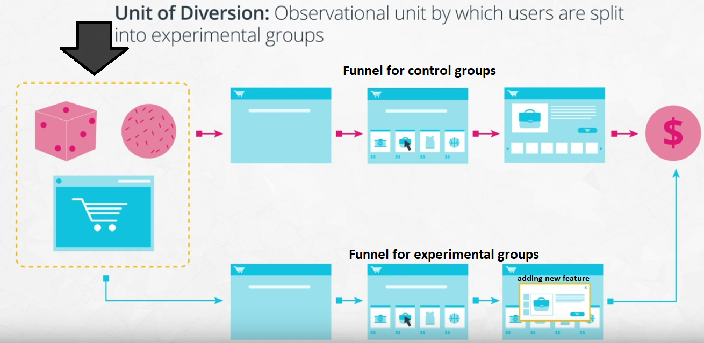

# Introduction
IF you see that two variables are related to one another doesn't mean that when one changes the other also changes as well which gives meaning **Correlation does not imply causation**.  However, there will be cases where you do want to say that **one variable causes another to change**. You might want to say that changes to your website cause visitors to make more purchases or maybe you want to show that changes to your recommendation engine provide better search results to your users.  To test your hypotheses,
you should run an **experiment**. This is why experiment design is so important for data scientists to know about the scope of conclusions that they can make from their data. 

In this Repo you'll learn:

   #### 1. Experiment design

   #### 2. About the types of experiments
   
   #### 3. Types of Sampling

   #### 4. Ways of measuring outcomes

   #### 5. Check for Controlling Variables, Validity and  Bias
   
   #### 6.  Ethics in Experimentation
   
   #### 7.  A SMART Mnemonic for Experiment Design

 ## 1.  Experiment Design
 
 Assume we want to add a new feature to our website to see if this new feature leads to more sales. 
 
 * First to create an experiment we need to perform a comparison between two groups. If we have some people interact with the old website without this new feature and some people interact with the new website with this new feature then a difference in purchases made by each group will show us the effect of the new feature.
 
 

 
 *  Secondly, we need to control for other differences between groups. The only difference between the two groups should be the feature that we specifically manipulate (whether the customer gets the site with the feature or the site without the feature). The typical way of doing this is through randomization.
For each customer, we randomly assign them to a site version. By randomly assigning individuals to each page, the distribution of other variables like age or gender should be similar between groups.  **The only practical difference between the groups should be the feature we care about whether they got the new feature or not.** 
 
  
 

 
 
**Sometimes, you might not be able to run a true experiment to test your hypotheses due to not having multiple groups or not being able to control random assignment to groups.** This will require  to consider alternative study designs. These methods can be put into three main bins, based on the amount of control that you hold over the variables in play:

   1. If you have a lot of control over features, then you have an **experiment**. In the social and medical sciences, an experiment is defined by comparing outcomes between two or more groups, and ensuring equivalence between the compared groups except for the manipulation that we want to test.
    

   
   2. If you have no control over the features, then you have an **observational study**. A classic example of this is on the risks posed by smoking.  The hypothesis is that smoking increases the likelihood of developing diseases like lung cancer. Because it is **unethical** for us to make people smoke in order to run an experiment for testing our hypothesis. Instead, we need to rely on collecting data passively making connections between smoking rates and disease incidences based on groups or matched individuals. Establishing causality is very difficult or perhaps even impossible with an observational study.
    
 

 

   
   3. If you have some control, then you have a **quasi-experiment**. One example of this is when a video game company rolls out a patch to modify character and item attributes.This may then have an effect on character and item popularity, since everyone is affected in the same way and We have only one group to track and there's no control group in our analysis, we can only compare the games ecosystem from before the patch and from after the patch.  If we see changes then there is the possibility for other factors to have caused these changes not just the patch itself. 

 

 
Another classic example of the quasi-experiment is if a researcher wants to test some new supplemental materials for a high school course. If they select two different schools, one with the new materials and one without, we have a quasi-experiment since the differing qualities of students or teachers at those schools might have an effect on the outcomes. Ideally, we'd like to match the two schools before the test as closely as possible, but we can't call it a true experiment since the assignment of student to school can't be considered random.

## 2. Types of Experiment

Most of the time, when you think of an experiment, you think of a **between-subjects experiment**. In a between-subjects experiment, each unit only participates in, or sees, one of the conditions being used in the experiment. The simplest of these has just two groups or conditions to compare. In one group, we have either **no manipulation, or maintenance of the status**. This is like providing a known drug treatment, or an old version of a website. This is known as **the control group**. The other group **includes the manipulation** we wish to test, such as a new drug or new website layout. This is known as our **experimental group**. We can compare the outcomes between groups (e.g. recovery time or click-through rate) in order to make a judgement about the effect of our manipulation. (Since we have an experiment, we'll randomly assign each unit to either the control or experimental group.) **For web-based experiments, this kind of basic experiment design is called an A/B test**: the "A" group representing the old control, and "B" representing the new experimental change.

**Note:** We aren't limited to just two groups. We could have multiple experimental groups to compare, rather than just one control group and one experimental group. This could form an A/B/C test for a web-based experiment, with control group "A" and experimental groups "B" and "C".

 

 

If an individual completes all conditions, rather than just one, this is known as **a within-subjects design**. Within-subjects designs are also known as **repeated measures designs**. By measuring an individual's output in all conditions, we know that the distribution of features in the groups will be equivalent. We can account for individuals' inclinations in our analysis. For example, if an individual rates three different color palettes for a product, we can know if a high rating for one palette is particularly good compared to the others (e.g. 10 vs. 5, 6) or if it's not a major distinction (e.g. 10 vs. 8, 9).

Randomization still has a part in the within-subjects design in the order in which individuals complete conditions. This is important to reduce potential bias effect. One other downside of the within-subjects design is that it's not always possible to pull off a within-subjects design. For example, when a user visits a website and completes their session, we usually can't guarantee when they'll come back. The purpose of their following visit also might not be comparable to their first. It can take a lot more effort in control in order to set up an effective within-subjects design.

## 3. Types of Sampling

 If you need to perform a survey of a population, it could be unreasonable in both time and money costs to try and collect thoughts from every single person in the population. This is where sampling comes in. The goal of sampling is to only take a subset of the population, using the responses from that subset to make an inference about the whole population. Here, we'll cover two basic probabilistic techniques that are commonly used.
 
 

* The simplest of these approaches is **simple random sampling**. In a simple random sample, each individual in the population has an equal chance of being selected. We just randomly make draws from the population until we have the sample size desired; your sample size depends on the level of uncertainty you are willing to have about the collected data. Since everyone has an equal chance of being drawn, we can expect the feature distribution of selected units to be similar to the distribution of the population as a whole. In addition, a simple random sample is easy to set up.

* It is possible that certain groups are underrepresented in a simple random sample, especially those that make up a low proportion of the population. If there are certain rarer subgroups of interest, it can be worth adding one additional step and performing **stratified random sampling**. In a stratified random sample, we need to first divide the entire population into disjoint groups and each individual must be a part of one group. Then, from each group, you take a simple random sample. In a proportional sample, the sample size is proportional to how large the group is in the full population.
 

   
   
   **Note:** As noted at the start, the goal of sampling is to use a subset of the whole population to make inferences about the full population, so that we didn't need to record data from everyone. To that end, **probabilistic sampling techniques** were described above try to obtain a sample that was representative of the whole. However, it's useful to note that there also exist **non-probabilistic sampling techniques** that simplify the sampling process, at the risk of harming the validity of your results.

 
 ## 4. Ways of measuring Outcomes 
 
 The goals of your study may not be the same as the way you evaluate the study's success. Perhaps this is because the goal is something that can't be measured directly. Let's say that you have an idea of a website addition that improves user satisfaction. How should we measure this? In order to evaluate whether or not this improvement has happened, you need to have a way to objectively measure the effect of the addition. For example, you might include a survey to random users to have them rate their website experience on a 1-10 scale. If the addition is helpful, then we should expect the average rating to be higher for those users who are given the addition, versus those who are not. The rating scale acts as a concrete way of measuring user satisfaction. These objective features by which you evaluate performance are known as **evaluation metrics**.
 
 As a rule of thumb, it's a good idea to consider the goals of a study separate from the evaluation metrics. This provides a couple of useful benefits:

* First, this makes it clear that the metric isn't the main point of a study: it's the implications of the metric relative to the goal that matters. This is especially important if a metric isn't directly attached to the goal. For example, measuring students' confidence going into a standardized test might be a proxy for the goal of test preparedness, in the absence of being able to get their test scores directly or in a timely fashion.

* Secondly, having the metric separate from the goal can clarify the purpose of conducting the study or experiment. It makes sure we can answer the question of why we want to run a study or experiment. From the above example, we aren't measuring confidence just to make people feel good about themselves: we're doing it to try and improve their actual performances.

**Note:** You might hear other terminology for goals and evaluation metrics than those used in this section. In the social sciences, it's common to hear a **"construct" as analogous to the goal or objective under investigation** and **the "operational definition" as the way outcomes are measured**.

For designing experiments, especially for web-based studies we will often think of **the user funnel**. A funnel is **the flow of steps you expect a user of your product to take**. Typically, the funnel ends at the place where your main evaluation metric is recorded, and includes a step where your experimental manipulation can be performed. For example, we might think of the following steps for someone to purchase a product in an online store:

   * Visit the site homepage
   * Search for a desired product or click on a product category
   * Click on a product image
   * Add the product to the cart
   * Check out and finalize purchase
   
**One property to note about user funnels is that typically there will be some dropoff in the users that move from step to step. This is much like how an actual funnel narrows from a large opening to a small exit.**

Once you have a funnel, think about how you can implement your experimental manipulation in the funnel. We need to figure out a way to assign users to either a control group or experimental group. The place in which you make this assignment is known as **the unit of diversion**. 

Depending on the type of experiment you have, you might have different options for diversion, each with its own pros and cons:

* **Event-based diversion:** (e.g. pageview) Each time a user loads up the page of interest, **the experimental condition** is randomly rolled. Since this ignores previous visits, this can create an inconsistent experience, if the condition causes a user-visible change.

* **Cookie-based diversion:** A cookie is stored on the user's device, which determines their experimental condition as long as the cookie remains on the device. Cookies don't require a user to have an account or be logged in, but can be subverted through anonymous browsing or a user just clearing out cookies.

* **Account-based diversion:** (e.g. User ID) User IDs are randomly divided into conditions. Account-based diversions are reliable, but requires users to have accounts and be logged in. This means that our pool of data might be limited in scope, and you'll need to consider the risks of using personally-identifiable information.

**Note:** When it comes to selecting a unit of diversion, **the consistency of the experience required can be a major factor to consider**. For the example provided, we need something more consistent than pageview events. So we then consider the cookie-based diversion. If the differences in interface between control and experiment are fairly minor, then we're probably okay with cookie-based diversion. But if we think that users will notice the change and we believe that it will have a major effect on experience, then we might be inclined to choose an account-based diversion.

A funnel will also be of benefit when it comes to deciding on metrics to track and analyze as part of the experiment. The immediate features that come out of a funnel come in the form of counts and ratios. For example, we could count the number of times a search results in a product being selected (a count), or the ratio of selections to searches as adjacent slices in the funnel (a ratio).

There are **two major categories that we can consider features: as evaluation metrics or as invariant metrics**. 

* **Evaluation metrics** are the metrics by which we compare groups. Ideally, we hope to see a difference between groups that will tell us if our manipulation was a success. We might want to see an increased click-through-rate from search results to products, or an increase in overall revenue. 

* On the flip side, **invariant metrics** are metrics that we hope will not be different between groups. Metrics in this category serve to check that the experiment is running as expected. For example, in an experiment with cookie-based diversion, the number of cookies generated for each condition would be a good invariant metric. Another metric could compare the distribution of times in which cookies were generated, to check the bias in the randomization procedure.

**Notice:** We're not limited to tracking just one metric of each type but It's better to focus on a few key metrics, ignoring features that might be less reliable or highly correlated to other, more informative features.

## 5. Check for Controlling Variables, Validity and  Bias

In this section you'll learn about potential problems that can weaken a study's usefulness. racall that the goal of experiment is to show that **changes in one variable cause changes in a second, comes from controlling for the effects of our other variables**. Ideally, we would like the distribution of all our variables to remain the same across our groups (experiment and control) except for the one that we manipulated to be different. 

If we aren't able to control all features or there is a lack of equivalence between groups, then we may be susceptible to **confounding variables meaning the correlation observed between two variables might be due to changes in a third variable, rather than one causing the other**. Another possibility is that there is a causal relationship between the two features, but it is an indirect relationship mediated by a third, intermediate variable. 

#### When designing an experiment, it's important to keep in mind **validity**, which concerns how well your experiment accomplishes what it sets out to perform. There are three major conceptual dimensions upon which validity can be assessed:

   * Construct Validity
   * Internal Validity
   * External Validity

* #### Construct Validity
You want to make sure thet your metrics are aligned with your study's goals, this is **Construct validity**. Poor construct validity can come about when an evaluation metric does not actually measure something related to the desired outcome. Alternatively, it might be that a metric is ill-constructed, such that it does not make clear distinctions on the outcome concept.

* #### Internal Validity

Internal validity refers to the degree to which a causal relationship can be derived from an experiment's results. Controlling for and accounting for other variables is key to maintaining good internal validity. **Simply taking the correlation between the two as a causal relationship without accounting for other variables is a sign that internal validity has not be met.** (here should be checked the confunding variables)

* #### External Validity

External validity is concerned with the ability of an experimental outcome to be generalized to a broader population. This is most relevant with experiments that involve sampling: how representative is the sample to the whole? For studies at academic institutions, a frequent question is if data collected using only college students can be generalized to other age or socioeconomic groups.

#### In addition to check validity, you should check for sources of biases in your experimental designs. **Biases in experiments are systematic effects that affect the interpretation of experimental results**, mostly in terms of internal validity. Just as humans can have a lot of different biases, there are numerous ways in which an experiment can become unbalanced.

* #### Sampling Bias

Many experimental biases fall under the **sampling bias** umbrella. **Sampling biases are those that cause our observations to not be representative of the population**. For example, if assignment to experimental groups is done in an arbitrary fashion (as opposed to random assignment or matched groups), we risk our outcomes being based less on the experimental manipulation and more on the composition of the underlying groups.

Studies that use surveys to collect data often have to deal with the **self-selection bias**. The types of people that respond to a survey might be qualitatively very different from those that do not. A straight average of responses would not necessarily reflect the feelings of the full population; weighting responses based on the differences between the observed responses and properties of the target population may be needed to come to reasonable conclusions.

One type of sampling bias related to **missing data** is the **survivor bias**. **Survivor bias is one where losses or dropout of observed units is not accounted for in an analysis**. A key example of this was in British World War II operations research, where engineers avoided using survivor bias when they considered where to add armor to their planes. Rather than add armor to the spots where returning planes had bullet holes, armor was added to the spots where the planes didn't have bullet holes. That's because the planes that took shots to those places probably crashed, due to those locations being more vital for maintaining flight, so they didn't "survive" and weren't available for observation.

* #### Novelty Bias

**A novelty effect is one that causes observers to change their behavior simply because they're seeing something new**. We might not be able to gauge the true effect of a manipulation until after the novelty wears off and population metrics return to a level that actually reflects the changes made. This will be important for cases where we want to track changes over time, such as trying to get users to re-visit a webpage or use an app more frequently. Novelty is probably not a concern (or perhaps what we hope for) when it comes to manipulations that are expected to only have a one-shot effect.

* #### Order Biases

There are a couple of biases to be aware of when running a **within-subjects experiment**. Recall that in a within-subjects design, each participant performs a task or makes a rating in multiple experimental conditions, rather than just one. **The order in which conditions are completed could have an effect on participant responses**. A **primacy effect is one that affects early conditions, perhaps biasing them to be recalled better or to serve as anchor values for later conditions**. A **recency effect is one that affects later conditions, perhaps causing bias due to being fresher in memory or task fatigue**.

An easy way of getting around order biases is to simply randomize the order of conditions. If we have three conditions, then each of the six ways of completing the task (ABC, ACB, BAC, BCA, CAB, CBA) should be equally likely. While there still might end up being order effects like **carry-over effects**, where a particular condition continues to have an effect on future conditions, this will be much easier to detect than if every participant completed the task in the exact same order of conditions.

* #### Experimenter Bias

One bias to watch out for, especially in face-to-face experiments, is **the experimenter bias**. This is where the presence or knowledge of the experimenter can affect participants' behaviors or performance. If an experimenter knows what condition a participant is in, they might subtly nudge the participant towards their expected result with their interactions with the participant. In addition, participants may act differently in the presence of an experimenter, to try and act in the 'right' way – regardless of if a subject actually knows what the experimenter is looking for or not.

## 6. Ethics in Experimentation

Before you run an experiment, it's important to consider the ethical treatments to which you subject your participants. Through the mid-20th century, exposure of questionable and clearly unethical research in the social and medical sciences spurred the creation of guidelines for ethical treatment of human subjects in studies and experiments. While different fields have developed different standards, they still have a number of major points in common:

   * **Minimize participant risk:** Experimenters are obligated to construct experiments that minimize the risks to participants in the study. Risk of harm isn't just in the physical sense, but also the mental sense. If an experimental condition has potential to negatively affect a participant's emotions or mentality, then it's worth thinking about if the risks are really necessary to perform the desired investigation.

   * **Have clear benefits for risks taken:** In some cases, risks may be unavoidable, and so they must be weighed against the benefits that may come from performing the study. When expectations for the study are not clearly defined, this throws into question the purpose of exposing subjects to risk. However, if the benefits are shown to be worth the risks, then it is still possible for the study to be run. This often comes up in medicine, where test treatments should show worthy potential against alternative approaches.

   * **Provide informed consent:** Building up somewhat from the previous two points, subjects should be informed of and agree to the risks and benefits of participation before they join the study or experiment. This is also an opportunity for a participant to opt out of participation. However, there are some cases where deception is necessary. This might be to avoid biasing the participant's behavior by seeding their expectations, or if there is a dummy task surrounding the actual test to be performed. In cases like this, it's important to include a debriefing after the subject's participation so that they don't come away from the task feeling mislead.

   * **Handle sensitive data appropriately:** If you're dealing with identifiable information in your study, make sure that you take appropriate steps to protect their anonymity from others. Sensitive information includes things like names, addresses, pictures, timestamps, and other links from personal identifiers to account information and history. Collected data should be anonymized as much as possible; surveys and census results are often also aggregated to avoid tracing outcomes back to any one person.

In the formal sciences, an experiment proposal must go through a review board before it can be run, to ensure that ethical principles have been followed. It's likely that you won't have a review board to submit your designs to prior to running an experiment. You'll need to evaluate these principles for yourself or with your colleagues to check for potential ethical issues before going forward with a study design.

One particular point worth further discussion is that of informed consent for web-based experiments. It's often the case that when an experiment is run, users who are included in an experiment often don't know that they're participating in an experiment. If a manipulation carries no risk and is so minor as to be hidden away from the user (e.g. a change in recommendation engine), perhaps there is no need for informed consent. And when it comes to bias, it's known that peoples' behaviors can change when they know they are under observation. In practice, informed consent is often not considered when performing a web experiment.

However, informed consent is still an important ethical principle, so there is continuing debate on how to best obtain consent for users of a website. One option could be to allow users to opt out of experiment participation, with the default user agreement implying consent to participation in unobtrusive experiments. An opposing option would only run experiments on users who opt-_in_ to participation, asking the user to set their preference on their initial visit or registration. The opt-in approach is more in line with the core idea of informed consent, but also risks fewer users available for testing changes.

## 7. A SMART Mnemonic for Experiment Design

There's a mnemonic called **SMART** for teams to plan out projects that also happens to apply pretty well for creating experiments. The letters of **SMART** stand for:

   * **Specific:** Make sure the goals of your experiment are specific.
   * **Measurable:** Outcomes must be measurable using objective metrics
   * **Achievable:** The steps taken for the experiment and the goals must be realistic.
   * **Relevant:** The experiment needs to have purpose behind it.
   * **Timely:** Results must be obtainable in a reasonable time frame.
