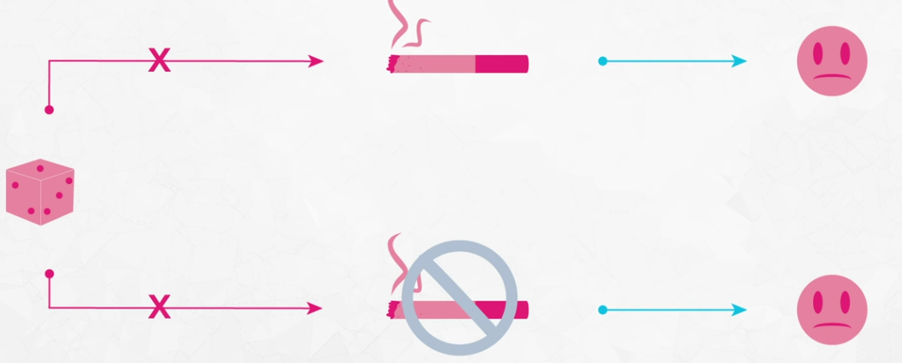

# Experimental Design
IF you see that two variables are related to one another doesn't mean that when one changes the other also changes as well which gives meaning **Correlation does not imply causation**.  However, there will be cases where you do want to say that **one variable causes another to change**. You might want to say that changes to your website cause visitors to make more purchases or maybe you want to show that changes to your recommendation engine provide better search results to your users.  To test your hypotheses,
you should run an experiment. This is why experiment design is so important for data scientists to know about the scope of conclusions that they can make from their data. 

In this Repo you'll learn
   #### 1. what it takes to build an experiment. 

   #### 2. about the types of experiments,

   #### 3. ways of measuring outcomes,

   #### 4. pitfalls to check for when designing an experiment.

 ## 1. What is an Experiment?
 
 Assume we want to add a new feature to our website to see if this new feature leads to more sales. 
 
 * First to create an experiment we need to perform a comparison between two groups. If we have some people interact with the old website without this new feature and some people interact with the new website with this new feature then a difference in purchases made by each group will show us the effect of the new feature.
 
 

 
 *  Secondly, we need to control for other differences between groups. The only difference between the two groups should be the feature that we specifically manipulate (whether the customer gets the site with the feature or the site without the feature). The typical way of doing this is through randomization.
For each customer, we randomly assign them to a site version. By randomly assigning individuals to each page, the distribution of other variables like age or gender should be similar between groups.  **The only practical difference between the groups should be the feature we care about whether they got the new feature or not.** 
 
  
 

 
 
 
  Sometimes, you might not be able to run a true experiment to test your hypotheses due to not having multiple groups or not being able to control random assignment to groups.
This will require  to consider alternative study designs. These methods can be put into three main bins, based on the amount of control that you hold over the variables in play:

   1. If you have a lot of control over features, then you have an **experiment**. In the social and medical sciences, an experiment is defined by comparing outcomes between two or more groups, and ensuring equivalence between the compared groups except for the manipulation that we want to test.
    

   
   2. If you have no control over the features, then you have an **observational study**. A classic example of this is on the risks posed by smoking.  The hypothesis is that smoking increases the likelihood of developing diseases like lung cancer. Because it is **unethical** for us to make people smoke in order to run an experiment for testing our hypothesis. Instead, we need to rely on collecting data passively making connections between smoking rates and disease incidences based on groups or matched individuals. Establishing causality is very difficult or perhaps even impossible with an observational study.
    
 

 

   
   3. If you have some control, then you have a **quasi-experiment**. One example of this is when a video game company rolls out
a patch to modify character and item attributes.This may then have an effect on character and item popularity, since everyone is affected in the same way and We only have one group to track and there's no control group and in our analysis, we can only compare the games ecosystem from before the patch and from after the patch.  If we do see changes then there is the possibility for other factors to have caused these changes not just the patch itself. 

 

 
